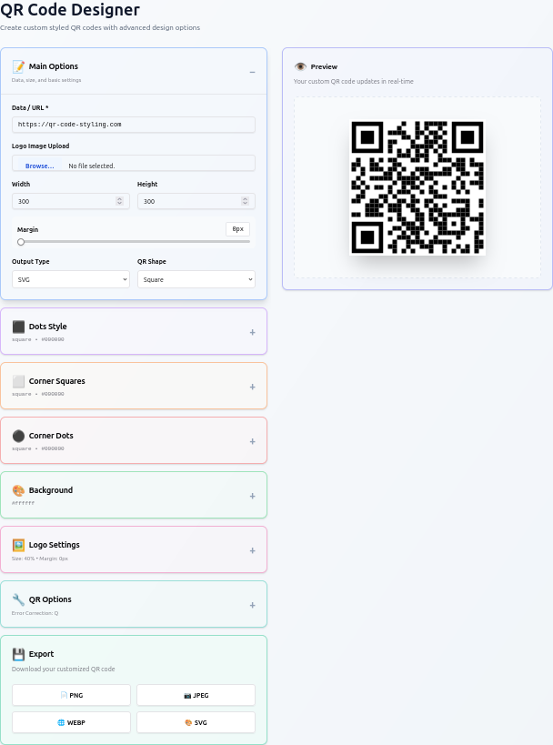

# QR Designer

A QR code designer application built with React, TypeScript, and [qr-code-styling](https://github.com/kozakdenys/qr-code-styling).



## Building with Docker

```bash
docker build -t qr-designer .
```

## Running

```bash
docker run -p 80:80 qr-designer
```

## Kubernetes Deployment

Deploy to Kubernetes using the provided configuration:

```bash
kubectl apply -f qr-code-kube.yml
```

## Development

```bash
npm install
npm run dev
```

## Dependencies

This project uses `qr-code-styling` for QR code generation and customization.
